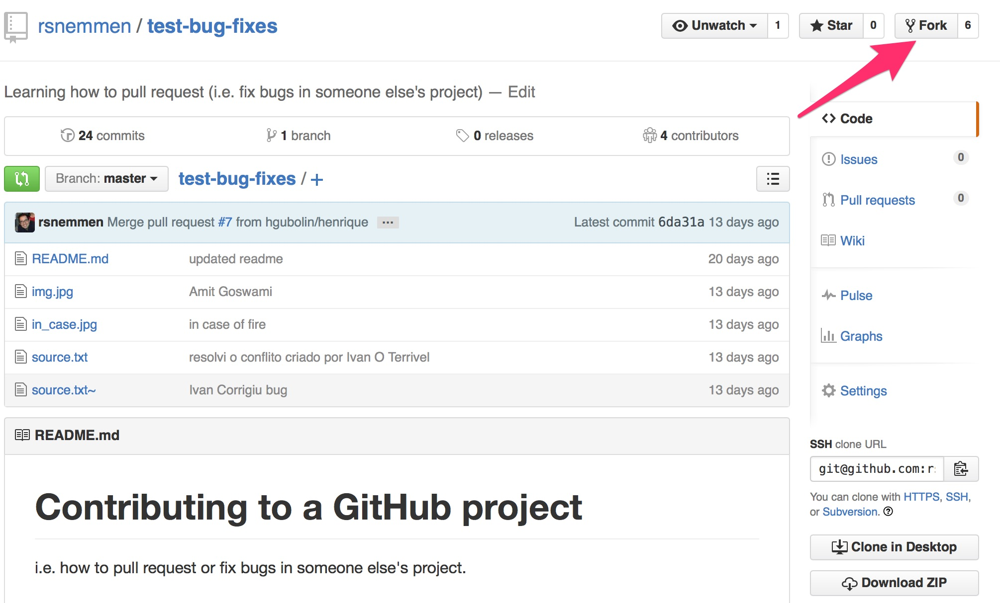

Contributing to a GitHub project 
============

This tutorial will help with the following situation: when you are proposing changes to someone else's repo for which you do not have write permissions.

TL;DR: how to pull request or fix bugs in someone else's project.

# Tasks

### 1. fork this repo

i.e. create your own copy of this.



### 2. clone locally your fork

### 3. [Configure your fork to point to the original repo](https://help.github.com/articles/configuring-a-remote-for-a-fork/)

### 4. create a branch for your edits

```
git checkout -b yourname
```

### 5. open *source.tex* and each person fixes a specific "error" in the "source code"

But wait for me, I will tell you what an "error" means in this context. 

### 6. [Create the pull request](https://help.github.com/articles/creating-a-pull-request/): contribute your bug fix to the code

### [7. sync your fork with the original repo](https://help.github.com/articles/syncing-a-fork/)

In order to check out how the original project is evolving (or not) with the input of the group.

# Links

[Contributing to open source on github](https://guides.github.com/activities/contributing-to-open-source/)
